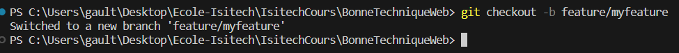

# EXAMEN

## 1. 

- Branch : environnement dans lequel on travail
- Commit : une modification réalisé dans une branch, accompagné d'un message pour décrire les modifications apportés
- Tag : utilisés pour marquer des versions

## 2.

- Cloner dépôt : git clone <url https ou ssh>
- Créer une nouvelle branch : git branch -b <nom de la branch>
- Commiter des modifications : git add "." ou <nom du fichier> puis git commit -m "message du commit"
- Pousser les modifications : git push

## 3.

Les principales branches sont : 
- branch main (ou master cela dépend), elle représente la version qui est en production, donc qui est stable
- develop, branche sur laquel est mis en préprod les nouvelles fonctionnalités
- feature , créer à partir de develop (ou main en fonction de comment l'on travail mais conseillé develop), elles sont créée pour ajouter de nouvelle fonctionnalité, dès que c'est terminé elles sont merges avec develop
- hotfix, pour un bug à appliquer en urgence

## 4.

C'est le fichier README.md.<br>
Le projet Jekyll est un générateur de site statique. Jekyll prend nos fichierds markdown et les templates 'Liquid' pour générer un site web comptatible avec Apashe, Nginx ou d'autres hébergeurs. C'est le moteur qui est utilisé sur Github Pages pour héberger nos sites depuis nos repository.

## 5.

- Cette commande permet de cloner le projet Jekyll mais depuis notre repository à nous.
- 

## 6.

<br>
- La commande `git branch -a` permet de lister toutes les branches disponibles dans le dépôt Git, que ce soit celles distantes comme locales (option `a` étant pour all).
- Elle est utilite pour donner une vue d'ensembles et surtout savoir celle que l'on a dépôt ou en locale et aussi avoir le nom pour pouvoir reprendre une branch pour travailler dessus si besoins.

## 7.

<br>
- Ce commande permet de créer une nouvelle branche et de s'y placer directement dessus pour travailler.
- Cette branche représente, par son nomination `feature`, qu'elle a été créée dans le but d'apporter de nouvelle fonctionnalité au projet.

## 8.


Cette commande permet de voir l'historique des commit sous de forme de graph (`--graph`) et sur une ligne (`oneline`, visuel que du sha du commit et de son message).  Elle aide à comprendre dans quelle démarche le travail a été effectué et de savoir la nature des différents commit (feature/fix/bug/etc...).

## 9.

- `git add .`, va permettre de tracker notre fichier modifié
- `git commit -m "Fictive Feature`, permet d'enregistrer les modification apportés avec un message associés à celui-ci pour expliquer son utilité
- `git rebase master`, en faisant un rebase on rapporte notre branch sur laquelle on travail et master au même point
- `git push origin feature/myfeature`, premier push de notre branch pour envoyer ces modifications à notre dépôt distant afin d'y créer une Pull Request et c'est important pour avoir une review (relecture) de notre équipe (si il y en a une) avant de mettre en prod.


## 10.

```sh
git checkout -b "fix/bug-fix"
git add README.markdown
git commit -m "Fix bug"
git checkout master
git merge fix/bug-fix
git push
```


## 11.

```sh
git checkout -b "fix/bug-fix2"
git add README.markdown
git commit -m "Fix bug2"
git checkout master
git add README.markdown
git commit -m "commit principal"
git merge fix/bug-fix
```
<br>
Après avoir réglé les conflits si il y en a  :
```sh
git add README.markdown (nom du fichier où il y avait les conflits)
git merge --continue
```
Un vim s'ouvre, pour savoir si on veut modifié le nom de notre commit :<br>


```sh
git push
```


## 12. BONUS

### 1. Structures de branches
Ils utilisent les branches en leurs donnant des noms specifiques ainsi que pour certaines la versions de la branche lorsqu'ils y apportent des nouvelles fonctionnalités. Il ont leurs workflow avec leurs tags, leurs branches avec leurs versions ainsi que des noms de branches explicite. Ce n'est pas le modèle de workflow que j'utiliserais.

### 2. Processus de Pull Requests
Pour les PR, ils mettent une description pour décrire les modifications apportès et pourquoi. Il n'hésite pas à mettre des commentaires et a y répondre. 

### 3. Gestion des Issues
Il précise l'utilité de l'ISSUE avec des prefix comme: featv(feature), bug docs. Elle permettre de savoir identifié ces Issue juste avec ça. Ils n'hésitent pas à avoir une discution dans les Issue.<br>

## 4. Conventions de Commit
Comme pour les ISSUE,ils mettent un prefix pour préciser la nature du commit, que ce soit `update`, `fix` ou `add`.<br>
Cela permet de savoir rapidement l'utilité du commit. 

## 5. Documentation et Guidelines